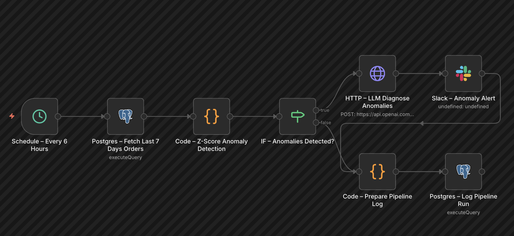

# Scheduled Data Pipeline: ETL, Anomaly Detection & AI Alerting (n8n)

An automated data observability pipeline built in n8n. This workflow continuously monitors database metrics, applies statistical anomaly detection, and leverages an LLM to diagnose issues before alerting the team via Slack.

## 🏗️ Architecture & Visual Flow

## 🎯 Objective
To proactively detect business disruptions (e.g., revenue drops, API failure spikes) using statistical thresholds, reducing time-to-resolution by providing engineering teams with an AI-generated diagnostic summary of the event.

## ⚙️ Core Logic & Features

1. **Scheduled Ingestion:** A Cron trigger executes the pipeline every 6 hours.
2. **Data Aggregation:** Queries a PostgreSQL database to aggregate hourly order metrics, revenue, and failure rates over a rolling 7-day window.
3. **Statistical Anomaly Detection:** Custom code calculates the mean and variance of the dataset. It flags data points that fall outside a strict $2.5$ standard deviation (Z-score) threshold as anomalies.
4. **Conditional Routing:** If no anomalies are detected, the workflow silently logs the run. If anomalies exist, it triggers the diagnostic branch.
5. **AI Diagnostics:** GPT-4o-mini acts as an automated business analyst, ingesting the anomaly data to generate a concise, 150-word report on what happened, likely causes, and recommended next steps.
6. **Incident Alerting:** Dispatches a formatted Slack alert containing the AI diagnosis, specific anomalous data points, and 7-day performance averages.
7. **Observability Logging:** Upserts the metadata of every pipeline run (timestamp, anomaly count, execution status) back into a PostgreSQL tracking table for long-term auditability.

## 🛠️ Tech Stack & Nodes Utilized
* **n8n:** Workflow orchestration, scheduling, and routing.
* **PostgreSQL:** Primary data warehouse and pipeline execution logging.
* **JavaScript:** Array manipulation and Z-score statistical calculations.
* **OpenAI API (GPT-4o-mini):** Automated root-cause analysis.
* **Slack API:** Real-time incident notification.

## 🚀 How to Import and Run

1. Copy the contents of `workflow.json`.
2. Open your n8n instance and select **Import from File**.
3. **Configure Credentials:** * Connect your PostgreSQL database. You will need to update the `SELECT` and `INSERT` query nodes to match your specific database schema.
   * Authenticate the OpenAI node with your API key.
   * Connect your Slack workspace via OAuth2 and designate an alerts channel.
4. Manually trigger the workflow to test the DB connection, or wait for the 6-hour cron schedule.
