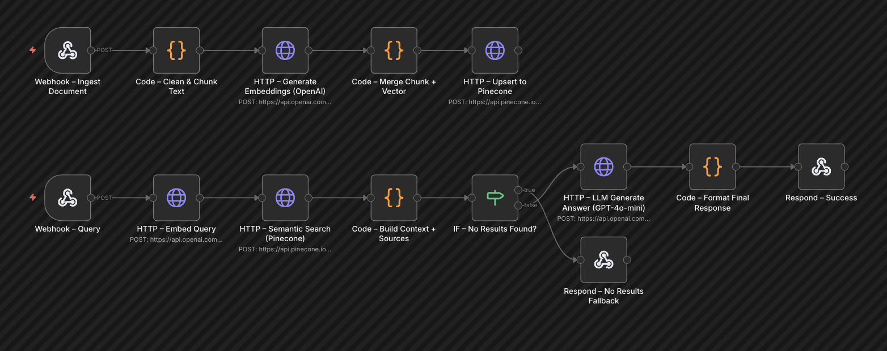

# RAG Pipeline: Document Ingestion & Intelligent Q&A (n8n)

A fully automated, end-to-end Retrieval-Augmented Generation (RAG) pipeline built from scratch in n8n. This architecture exposes two distinct API endpoints: one for processing and vectorizing knowledge documents, and another for querying that knowledge base using semantic search and LLM synthesis.

## 🏗️ Architecture & Visual Flow

## 🎯 Objective
To build a scalable, transparent Q&A system that grounds LLM responses strictly in proprietary documents, reducing hallucinations and providing clear source citations. 

## ⚙️ Core Logic & Features

### 1. Ingestion Branch (Document Processing)
* **Webhook Trigger:** Accepts HTTP POST requests containing document content and metadata.
* **Semantic Chunking:** Custom code splits the raw text into 512-word chunks with a 50-word overlap, preserving contextual boundaries.
* **Vectorization:** Calls OpenAI's `text-embedding-3-small` API to generate high-quality 1536-dimensional embeddings.
* **Vector DB Upsert:** Formats and stores the vectors alongside their metadata (source, filename, chunk index) into Pinecone.

### 2. Retrieval Branch (Query & Synthesis)
* **Query Embedding:** Converts the user's natural language question into a vector using the same OpenAI embedding model.
* **Semantic Search:** Queries Pinecone for the Top-K most similar document chunks.
* **Confidence Filtering:** A custom logic node filters out retrieved matches with a similarity score below `0.7`, ensuring the LLM only receives highly relevant context.
* **Conditional Routing:** An `IF` node acts as a safeguard. If no chunks meet the confidence threshold, it routes to a graceful fallback response to prevent the LLM from guessing.
* **Grounded Generation:** Injects the verified context into a strict system prompt. GPT-4o-mini synthesizes the final answer and explicitly cites its sources.

## 🛠️ Tech Stack & Nodes Utilized
* **n8n:** Workflow orchestration, routing, and custom HTTP requests.
* **OpenAI API:** `text-embedding-3-small` for vectorization and `gpt-4o-mini` for generation.
* **Pinecone:** Serverless vector database for similarity search.
* **JavaScript:** Text preprocessing, overlapping chunk logic, payload mapping, and response formatting.

## 🚀 How to Import and Run

1. Copy the contents of `workflow.json`.
2. Open your n8n instance and select **Import from File** on a blank canvas.
3. **Configure Credentials:** You will need to authenticate the following:
   * OpenAI API Key (for HTTP Request nodes).
   * Pinecone API Key (added as Header Auth `Api-Key`).
4. **Pinecone Setup:** Ensure you have created a Pinecone index with a dimension of `1536` and a cosine similarity metric.
5. **Testing the APIs:**
   * **To Ingest:** Send a POST request to the ingestion webhook with `{ "filename": "doc.txt", "content": "...", "source": "wiki" }`.
   * **To Query:** Send a POST request to the query webhook with `{ "question": "Your question here", "top_k": 5 }`.
